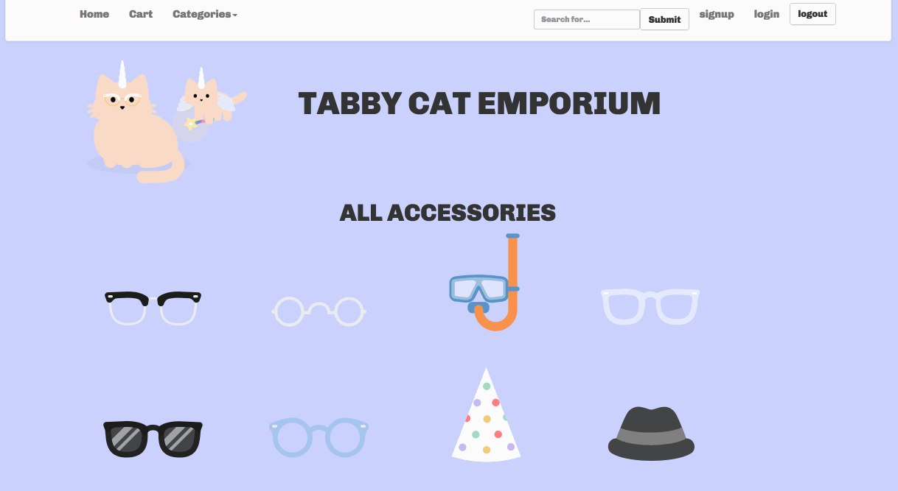

## Tabby Cat Emporium

Tabby Cat Emporium is an e-commerce website that sells accessories for your chubby tabby.
I was built by members of the 1707 Grace Hopper cohort to fulfill the requirements for the Grace Shopper Project.

You can find our live site HERE: (tabby-cat-store.herokuapp.com)

...and more about its inspiration HERE: (http://tabbycats.club/)

## Technologies used

React
React-Redux
React-Router
Bootstrap
Express
Node.js
Sequelize and PostgreSQL
Passport
Webpack
Babel

## Running this code in development

`npm install` them `npm start` will make great things happen!
Be sure to `node seed` to generate your db

## Contribution guide

The contribution process is...

1. Make an issue (or multiple issues)
2. Make a PR that references that issue
3. Get it code reviewed by someone on the team, address any comments
4. Merge into master (with merge commit)

### Code style guide

- Pay attention to the linter!
- Don't use semicolons
- Two spaces -- for indentation
- Trailing commas where possible
- Use `const` or `let` over `var`
- Use `require` and `module.exports` in `.js` files
- Use `import` and `export` in `.jsx` files, unless `require` makes for cleaner code
- Put import statements at top
- Put the default export at bottom
- Consider splitting up any file larger than 50 lines
- Define container components and presentational components in separate files
- Use the ["ducks" pattern](https://github.com/erikras/ducks-modular-redux) for redux
- Name files using lowercase-and-dashes instead of camelCase or PascalCase, except for when the default export is a class, then use PascalCase
- Define react components as pure functions (instead of classes) whenever possible
- Single quotes for strings – except to avoid escaping
- No unused variables
- Space after keywords `if (condition) { ... }`
- Space after function name `function name (arg) { ... }`
- Always use `===` instead of `==`

### Linter Guide

* `npm install -g eslint`
* In the root of your project, `eslint --init`
* You will then be prompted to choose how you want to configure ESLint - follow the style guide above

### Commit message guide

[See here](https://seesparkbox.com/foundry/semantic_commit_messages)
